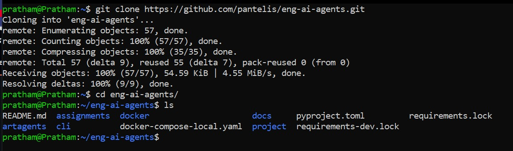
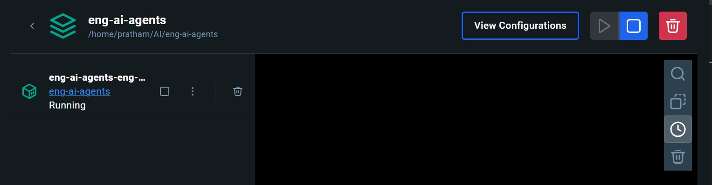
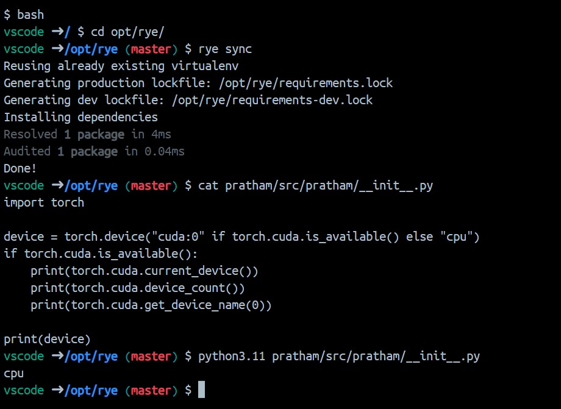

# Engineering AI Agents - Development Environment Setup

## PS: I have a windows system and it is does not have a GPU.

## 1. Cloning the Repository
First, I cloned the `eng-ai-agents` repository from GitHub, as shown below:

This step includes cloning the repository to my local machine using the command.

## 2. Loading the container in Docker
Second, after navigating into the cloned directory, I loaded the Docker container to set up the project environment. Below is a screenshot of the directory structure within the Docker container.

## 3. Activating Virtual Environment with Rye and running the Code provided
Inside the Docker container, I initialized the project environment using rye sync, which installs the required dependencies and activates the virtual environment. Below is a screenshot of the virtual environment setup.

